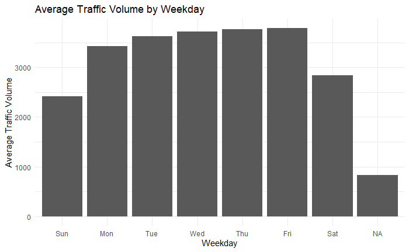
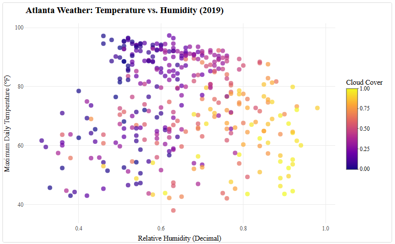
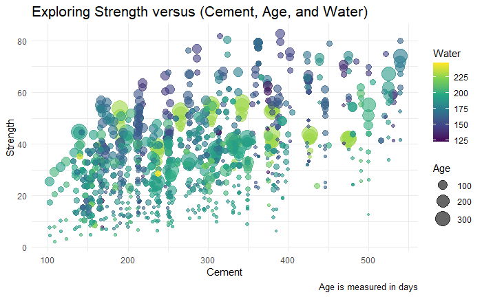

# Data Visualization and Reproducible Research

> Antonio Rocher-Hernandez 

The following is a sample of products created during the _"Data Visualization and Reproducible Research"_ course.

## Project 01

In the `project_01/` folder you can find the interactive bar chart showing average traffic volume by weekday.

This chart stands out because it allows users to explore differences between weekdays in an interactive way. Instead of passively viewing values, users can hover over each bar to see exact traffic levels, making comparisons more precise and engaging.

This visualization helped reveal clear commuting patterns, with higher traffic during weekdays and lower traffic on weekends.

## Project 02

In this project, I explored the relationship between humidity, temperature, and cloud cover.

This plot combines multiple variables into a single interactive view. Users can hover over individual points to see exact weather conditions for each day.

This interactivity makes it easier to understand how temperature and humidity interact across different weather conditions, especially when patterns are dense or overlapping.

## Project 03

In this project, I explored the relationship between cement content, water content, age, and concrete compressive strength.

This visualization combines multiple dimensions into a single plot while still remaining interpretable through interactivity. Hovering over points reveals detailed information about each concrete mixture, which helps explain how different ingredients influence strength.

It also highlights that higher cement and lower water content generally lead to stronger concrete, especially when allowed to cure over time.

### Moving Forward

Across all three projects, I learned that good data visualization is not just about making charts, but about designing clear, interpretable, and meaningful representations of data.

One of the biggest improvements in my work was learning how to use interactivity effectively. Instead of treating charts as static images, I learned how interactive visualizations can allow users to explore data in a deeper and more flexible way.

I also learned the importance of accessibility in visualization design. Using colorblind-safe palettes, clear labels, and avoiding reliance on color alone made my visualizations more readable and inclusive.

In future work, I plan to continue exploring:

- More advanced interactive visualization tools  
- Better storytelling techniques using layered visual narratives  
- Deeper use of spatial and temporal data visualization  
- Stronger reproducibility practices in data science workflows  
- More careful design choices to reduce cognitive load for viewers  

